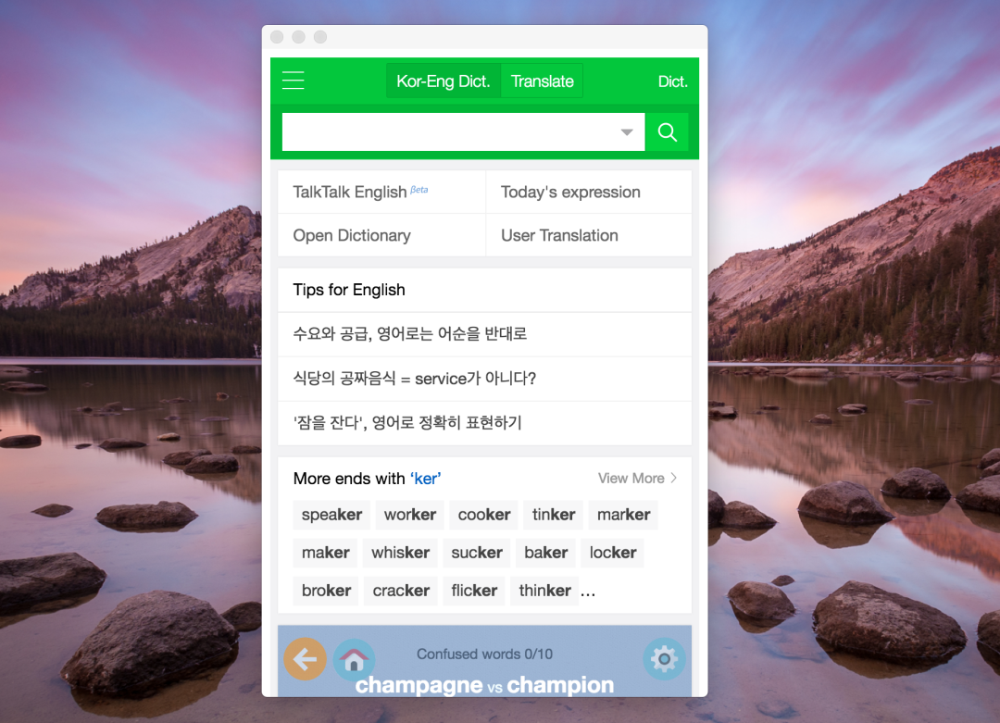

# MyDictionary
- This app is mini browser based on chrome desktop app.  
- You can use your favorite mobile web site on MyDictionary.

## Support
All platforms that support Chrome desktop browser.

- Linux  
- Mac OS
- Windows

## Download

## ScreenShopt

